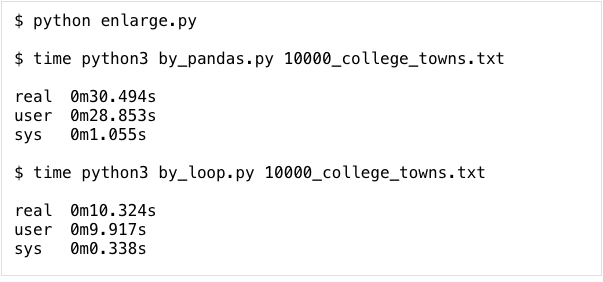

資料清理使用Pasdas與一般file loop的效能比較

檔案說明：

* by_pandas.py ，改寫自參考資料內的Python程式。原程式從網路下載資料，改寫為從本地檔案系統讀取待清理資料。並將dataframe輸出為tsv格式。(python3)

* by_loop.py，與by_pandas.py相同功能，但不使用pandas的方式作清理，輸出相同的tsv格式。(python3)

* college_towns.txt ，取自網路的待清理資料（樣本）。

* enlarge.py，將原始樣本放大的程式(python2)

操作方式：

.. code:: 

    # 產生output.by_loop.tsv及記錄執行時間
    $ time python3 by_loop.py college_towns.txt
    
    # 產生output.by_pandas.tsv及記錄執行時間
    $ time python3 by_pandas.py college_towns.txt
    
    # 比較兩者輸出結果
    $ diff output.by_loop.tsv output.by_pandas.tsv
    
    # 放大樣本,產生 10000_college_towns.txt
    # 如果要產生其他倍數，請修改程式內的 n 
    $ python2 enlarge.py

結果：

\ |IMG1|\ 

參考資料：

一、\ |LINK1|\ 

.. bottom of content

.. |LINK1| raw:: html

    <a href="https://medium.com/datainpoint/%E5%AF%AB%E7%A8%8B%E5%BC%8F%E6%98%AF%E8%B3%87%E6%96%99%E5%88%86%E6%9E%90%E7%9A%84%E5%BF%85%E8%A6%81%E6%8A%80%E8%83%BD-9ee15b58cc" target="_blank">寫程式是資料分析的必要技能</a>

